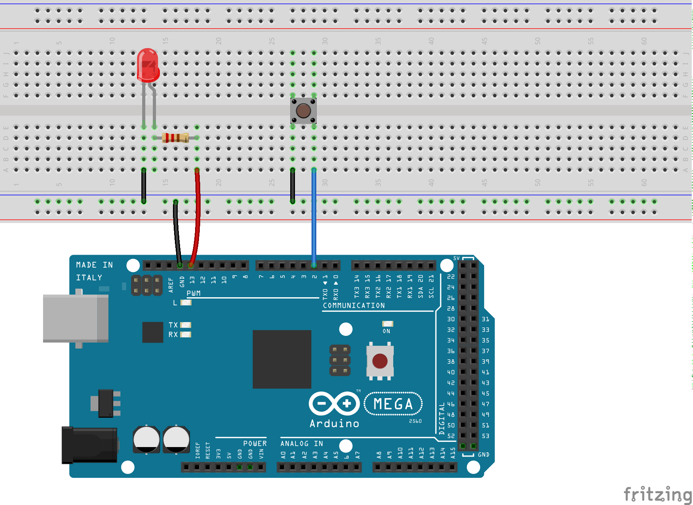

# arduino-sos-nappi
Morse/elekroniikka/ohjelmointipartiokokouksen ohjeet, kytkentäkaavio ja koodi

## Mitä tarvitaan?

* Tietokone
* Arduino IDE
* USB-A-johto
* Arduino-piiri, esim. Arduino MEGA2560
* Johtimia
* Painike
* LED
* Pieni vastus

## Mitä kokouksessa tehdään?

Kokouksessa lapset rakentavat napin painalluksesta SOS-morsekoodin vilkuttavan systeemin. Tekeminen on hyvä jakaa kahteen osaan, jossa kumpaakin saa tehdä rauhassa: kytkentöjen tekeminen koekytkentälevylle ja ohjelman tekeminen.

## Kytkennät

## Koodi

Kopioi [koodipohja](morse-kokous-pohja.ino) Arduino IDEen. Ohjelma vilkuttaa napin painalluksesta sanan TAKO. Siitä voi sitten lähteä muokkaamaan koodia, jotta napin painalluksella morsetetaan sana SOS.
